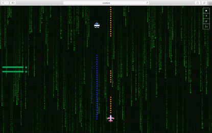

# 黑客帝国设计文档

> 姜其升 1752058

[TOC]

## 游戏简介

### 项目背景

2050年现实世界其实是由一个名叫“母体”的计算机人工智能系统控制，人们就像他们饲养的动物，没有自由和思想，而玩家发现了这一事实。为了逃脱控制、拯救人类，玩家必须驾驶虚拟的飞船打败由“母体”控制的飞船，保证自己安全的情况下，击毁越多的敌机玩家将获得更多的积分，就有更大的机会出逃。同时为了更好的与敌人对战，玩家也可以选择与同伴对战练习。

### 设计思路

游戏为经典的单机版飞机大战的改良版。

在单人模式下，玩家将与敌机进行对抗，敌机有不同的级别，差别体现在不同的生命值上，玩家可以使用不同的武器进行打击，不同的武器拥有不同的打击范围、伤害值和冷却时间，玩家需要躲避敌方的攻击和障碍物，击败敌人后玩家将获得一定的积分奖励，如果玩家被武器击中，则生命值会降低，玩家也可以开启保护罩进入无敌模式，在此阶段将不会受到攻击，保护罩拥有持续时间和冷却时间，当玩家生命值为0时，游戏结束，现实最终分数。

在对战模式下，两位玩家进行对抗，可以使用子弹攻击对方，同时需要躲避对方攻击，当其中一方生命值为0时，游戏结束，另一方获胜。

### 游戏玩法

#### 单机模式：

进入之后，如果检测到上次保存了游戏进度，则可以选择恢复游戏进度或者开启新游戏。

如果选择新游戏，则首先会选择战斗机，选择完成后进入游戏。游戏规则：破坏敌方单位将获得积分；当玩家血条为0时游戏结束；点击 空格 可以暂停或继续游戏；点击W向上移动；点击S向下移动；点击A向左移动；点击D向右移动；点击J使用射击技能；点击K使用激光技能；点L使用核弹技能；点击I使用保护技能。

| **敌方单位** |          |              |      |        |            |
| ------------ | -------- | ------------ | ---- | ------ | ---------- |
| **名称**     | 出现时间 | 在场最大数量 | 得分 | 生命值 | 是否会攻击 |
| **Enemy**    | 2s       | 10           | 50   | 50     | 是         |
| **Boss**     | 10s      | 2            | 500  | 1000   | 是         |
| **Block**    | 8s       | 6            | 30   | 150    | 否         |

| **技能说明** |                |          |
| ------------ | -------------- | -------- |
| **名称**     | 说明           | 冷却时间 |
| **射击**     | 普通攻击       | 100      |
| **激光**     | 更大的打击范围 | 100      |
| **核弹**     | 最具破坏性     | 100      |
| **保护**     | 免受攻击       | 100      |

点击Home按钮可以返回主页；点击Help按钮可以显示游戏说明；点击Restart按钮可以重新开始；点击Save按钮可以保存游戏进度并退出；点击空格可以暂停/继续游戏。

#### 对战模式：

进入之后，如果检测到上次保存了游戏进度，则可以选择恢复游戏进度或者开启新游戏。

如果选择新游戏，则会进入游戏说明页面。游戏规则：玩家相互攻击；当任一玩家血条为0时游戏结束；点击 空格 可以暂停或继续游戏。玩家1点击W向上移动；点击S向下移动；点击A向左移动；点击D向右移动；点击F使用射击技能。玩家2点击上方向键向上移动；点击下方向键向下移动；点击左方向键向左移动；点击右方向键向右移动；点击L使用射击技能。

点击Home按钮可以返回主页；点击Help按钮可以显示游戏说明；点击Restart按钮可以重新开始；点击Save按钮可以保存游戏进度并退出；点击空格可以暂停/继续游戏。

## 功能介绍

#### 功能1：选择不同的游戏模式

进入游戏首页后，可以看到两个不同的按钮“单机模式”和“对战模式”，可以选择不同的模式进行游戏，不同模式的具体介绍见上一节。

                

#### 功能2：选择不同的战机

在选择“单机模式”的情况下可以选择驾驶的战机，点击战机图片下方的按钮即可。

#### 功能3：保存游戏进度

在游戏界面，点击右上方第四个Save图标，可以保存当前游戏的进度并退出。具体的进度信息保存在浏览器的localStorage中。

#### 功能4：恢复游戏进度

在进入游戏时，如果检测到localStorage中存储有之前的游戏进度，则可以在弹出的选择是否恢复游戏进度的询问框中，点击是，则可以根据进度信息恢复之前的游戏进度。

#### 功能5：暂停或继续游戏

在游戏中可以点击空格暂停或继续游戏。

#### 功能6：移动飞机

在游戏中，根据提示，可以使用上下左右键或AWSD移动飞机的位置。

#### 功能7：使用普通攻击

在单机模式下，使用J可以进行射击；在对战模式下，双方可分别使用F和L进行射击。

 

#### 功能8：使用镭射攻击

在单机模式下，使用K可以使用镭射激光攻击，攻击范围变红，贯穿屏幕，伤害更高。持续一段时间后自动结束。拥有冷却时间，在使用后，一段时间内无法再次使用，直到冷却完成。

#### 功能9：使用核弹攻击

在单机模式下，使用L可以使用核弹攻击，首次点击时发射核弹，当核弹到达爆炸位置，再次点击核弹，使得核弹爆炸，核弹的攻击范围更广，伤害更高，爆炸结束后消失。拥有冷却时间，在使用后，一段时间内无法再次使用，直到冷却完成。

#### 功能10：使用保护罩

在单机模式下，使用I可以使用保护罩，防止受到任何伤害。持续一段时间后自动结束。拥有冷却时间，在使用后，一段时间内无法再次使用，直到冷却完成。

 

#### 功能11：重新开始

点击“Restart”按钮，可以重新开始。

#### 功能12：显示使用帮助

在游戏开始前或点击“Help”按钮

   

## 项目特点

**动态背景**

使用setInterval定时绘制随机出现的文本，之后下移使得背景动态变化。

**组件化开发**

封装多个组件，组件化开发，使用两个canvas，一个canvas用于绘制背景，另一个canvas用于绘制游戏场景，两个canvas相互叠加。

**保存恢复游戏进度**

通过localStorage保存当前游戏状态并之后可以通过存储的内容进行恢复游戏进度。

**提前加载资源**

在开始游戏前预先加载资源，节约加载时间，用户阅读完游戏规则后即可开始游戏。 

## 开发环境

前端开发框架：vue.js

服务器：nginx

项目地址：